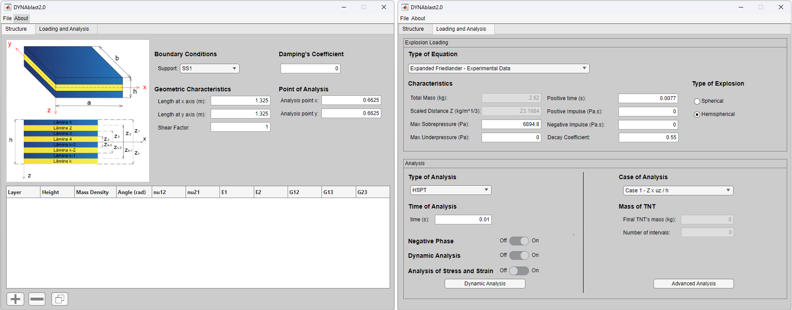
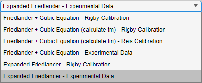
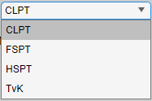
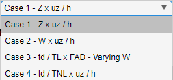
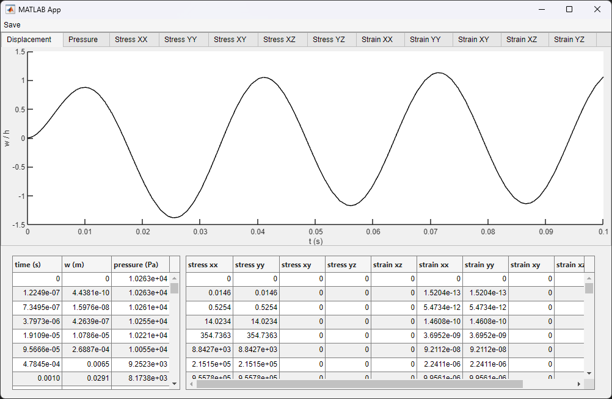
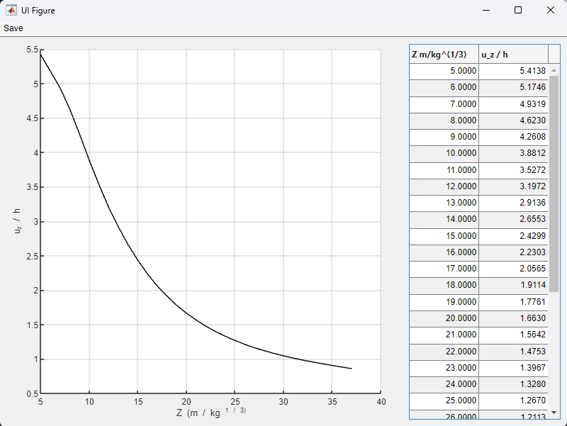
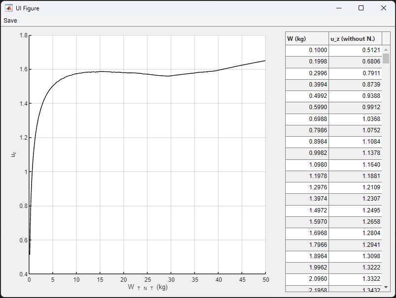

# DYNAblast Software Version 2.0

# Introdução

DYNAblast é um software desenvolvido na linguagem MATLAB, sendo projetado com o objetivo de realizar análises de estruturas de placas laminadas compósitas considerando o carregamento de explosões. Considerando este tipo de estrutura, suas modificações físico e geométricas e as características do explosivo a ser utilizado, o engenheiro/pesquisador torna-se capaz de projetar estruturas que possam ser resistentes ao colapso com o auxílio do DYNAblast. Outras aplicações podem ser destacadas, como as correspondentes linhas de pesquisas militares, aeronáutica, marinha, plataformas e dentre outros exemplos cujos quais podem ser surpreendidos por carregamentos de impactos (ondas de choque). Com base nisto, DYNAblast foi desenvolvido para facilitar as análises de deslocamentos, tensões e deformações das coordenadas do centro da estrutura de placa. Ademais, análises paramétricas são incorporadas ao programa, como averiguação das curvas de deslocamento máximo conforme modificações das características do explosivo, curvas de Fator de Amplificação Dinâmica e outras.
DYNAblast 2.0 corresponde à uma generalização e consideração de mais tipos de estruturas para com relação ao seu predecessor [DYNAblast 1.0](https://github.com/AnaWaldila/dynablast), cujas considerações eram restritas àpenas placas finas do tipo isotrópicas. Assim sendo, a versão 2.0 atualiza as análises de placas utilizando 4 tipos de teorias de placas lamiandas, podendo estas serem ortotrópicas e, ademais, aplicação de outras equações características das curvas de explosão.

## Metodologia

Toda a metodologia considerada para a construção do software encontra-se na Tese de Doutorado intitulada ["Análise dinâmica não linear de estruturas laminadas compósitas considerando o fenômeno da explosão"](https://www.bdtd.uerj.br:8443/handle/1/21714). Nesta tese, é possível observar as definições e formulações atreladas ao carregamento explosivo, bem como as teorias de placas utilizadas, metodologias e _**demonstração**_ de todas as formulações utilizadas. Assim sendo, esta presente descrição é restrita ao software DYNAblast versão 2.0.

## Software

Quando executado, DYNAblast inicializa com uma janela, como apresentada na Figura 1, apresentando duas _tabs_ para inserção de dados. Na primeira delas, são dados referentes às características físico-geométricas da estrutura. No segundo caso, encontram-se as características do tipo de análise a ser aplicada e os dados do carregamento explosivo.

 <b>Figure 1:</b> DYNAblast 2.0 - Input Data

### Características Físico-Geométricas da Estrutura

Na Figura 1 é possível averiguar as características físico geométricas da estrutura, tais como:

* _Boundary Conditions_: Support (SS1, SS2 ou CCCC). Neste caso, as condições de contorno são do tipo simplesmente apoiado (SS1 ou SS2) ou totalmente engastado (CCCC). No caso de SS1, corresponde à caracterização de placas do tipo _cross ply_. Já para SS2, são placas do tipo _angle ply_;
* _Damping's Coefficient_: caracteiza-se pelo coeficiente de amortecimento da estrutura, caso tenha;
* _Length at x axis (m)_: comprimento da placa ao longo do eixo x;
* _Length at y axis (m)_: comprimento da placa ao longo do eixo y;
* _Shear Factor_: coeficiente (ou fator) de cisalhamento, cujo qual é aplicável à teoria do tipo FSPT (First Shear Plate Theory);
* _Analysis point at x_: ponto cuja coordenada x deseja ser analisada;
* _Analysis point at y_: ponto cuja coordenada y deseja ser analisada;
* Tabela: Neste caso, a tabela corresponde a uma maneira fácil e simplificada de inserção das características de cada lâmina presente na placa laminada. É de suma importância do entendimento do usuário que a ordem de inserção das linhas corresponde à mesma ordem de inserção das lâminas. Em outras palavras, a primeira linha corresponde à lâmina de topo, seguindo ordenadamente até a última linha, que corresponde à lâmina de base. Assim sendo, as características a serem inseridas são _height_ (espessura da lâmina), _mass density_ (densidade da lâmina), _angle_ (angulação das fibras da lâmina, em radianos), _&nu;12_ e _&nu;12_ (coeficientes de Poisson), _E1_ e _E2_ (Módulo de Young) e, por fim, _G12_, _G13_ e _G23_ (Módulo de Cisalhamento).

Ainda na Figura, na segunda _tab_, pode-se observar dois _containers_ de separação: _Explosion Loading_ e _Analysis_. 
Para _Explosion Loading_, são requeridos as seguintes informações do usuário:

### Características da Explosão

* _Type of Equation_: Tipo de equação característica da curva de explosão. Neste caso são apresentadas 6 possibilidades (conforme Figura 2):
  1. _Friedlander + Cubic Equation - Rigby Calibration_: A fase positiva é caracterizada pela equação de Friedlander e a fase negativa é descrita conforme o polinômio cúbico. Nesses casos, os dados de entrada são dados conforme a distância escalada Z, no software _scale distance Z (kg/m^1/3)_ e a massa total de explosivo, _Total Mass (kg)_. Internamente, o software determina todos os valores característicos da explosão (pmax, pmin, td, tm dentre outros> conforme a calibração realizada por Rigby (2013);
  2. _Friedlander + Cubic Equation (calculating tm) - Rigby Calibration_: Utiliza-se os mesmos conceitos da primeira opção. Contudo, para este caso, o valor do tempo da fase negativa é calculada conforme equação de equilíbrio determinado por Granström (1956). Para determinação dos demais parâmetros, é considerada a calibração realizada por Rigby (2013);
  3. _Friedlander + Cubic Equation (calculating tm) - Reis Calibration_: Utiliza-se os mesmos conceitos da primeira opção. Contudo, para este caso, o valor do tempo da fase negativa é calculada conforme equação de equilíbrio determinado por Granström (1956). Para determinação dos demais parâmetros, é considerada a calibração realizada por Reis (2019);
  4. _Friedlander + Cubic Equation - Experimental Data_: A fase positiva é caracterizada pela equação de Friedlander e a fase negativa é descrita conforme o polinômio cúbico. Entretanto, os dados de entrada são diretamente os parâmetros característicos da explosão, ou seja, _Max Sobrepressure (Pa)_ (pressão máxima), _Max Underpressure (Pa)_ (máxima pressão mínima), _Positive time (s)_ (tempo de duração da fase positiva), _Positive Impulse (Pa.s)_ (impulso da fase positiva), _Negative Impulse (Pa.s)_ (impulso da fase negativa) e _decay coefficient_ (coeficiente de decaimento referente à fase positiva).
  5. _Expanded Friedlander - Rigby Calibration_: A equação governante da explosão é dada pela equação de Friedlander, inclusive para a fase negativa. Considera-se, neste caso, os dados de entrada a distância escalada Z, no software _scale distance Z (kg/m^1/3)_ e a massa total de explosivo, _Total Mass (kg)_. Internamente, o software determina todos os valores característicos da explosão (pmax, pmin, td, tm dentre outros> conforme a calibração realizada por Rigby (2013);
  6. _Expanded Friedlander - Experimental Data_: A equação governante da explosão é dada pela equação de Friedlander, inclusive para a fase negativa. Considera-se, neste caso, os dados de entrada são diretamente os parâmetros característicos da explosão, ou seja, _Max Sobrepressure (Pa)_ (pressão máxima), _Max Underpressure (Pa)_ (máxima pressão mínima), _Positive time (s)_ (tempo de duração da fase positiva), _Positive Impulse (Pa.s)_ (impulso da fase positiva), _Negative Impulse (Pa.s)_ (impulso da fase negativa) e _decay coefficient_ (coeficiente de decaimento referente à fase positiva).
 

 <b>Figure 2:</b> DYNAblast 2.0 - Type of Equation

Em _Characteristics_, são disponibilizados para edição os parâmetros de explosão conforme a escolha do usuário em _Type of Equation_. Assim sendo, parâmetros do tipo _scaled distance Z_ e _total mass_ (distância escalada Z e massa do explosivo, respectivamente), são disponibilizados para edição quando as opções 1, 2, 3 ou 5 em _Type of Equation_ é escolhida. Já os dados experimentais _Max Sobrepressure (Pa)_ (pressão máxima), _Max Underpressure (Pa)_ (máxima pressão mínima), _Positive time (s)_ (tempo de duração da fase positiva), _Positive Impulse (Pa.s)_ (impulso da fase positiva), _Negative Impulse (Pa.s)_ (impulso da fase negativa) e _decay coefficient_ (coeficiente de decaimento referente à fase positiva) ficam disponíveis quando as opções 4 ou 6 são escolhidas.

Em _Type of Explosion_ há duas opções: _spherical_ (esférico) ou _hemispherical (hemisférico). Essa opção se torna importante quando são escolhidas as opções 1, 2, 3 ou 5 em _Type of Equation_, visto que está diretamente relacionado com o ábaco a ser escolhido e, consequentemente, as calibrações realizadas, Reis (2019) ou Rigby (2013).

### Análise Dinâmica
No caso de _Analysis_, está diretamente espeficiado o tipo de análise que o usuário deseja atribuir ao modelo e alguns outros detalhes de especificação quanto a esta. O primeiro passo corresponde ao tipo de teoria a ser considerada, dentre 4 disponíveis, conforme Figura 3: CLPT (_Classical Laminated Plate Theory_, Teoria Clássica de Placas Laminadas), FSPT (_First Shear Plate Theory_, Toeria de Primeira Ordem no Cisalhamento em Placas), HSPT (_High Shear Plate Theory_, Teoria de Alta Ordem no Cisalhamento de Placas) e TvK (_von Karman Theory_, Teoria de von Karman).
Posteriormente, o usuário deve espeficar alguns outros quesitos, tais como:
* _Type of Analysis_: Tempo de duração do carregamento dinâmico. Naturalmente, o carregamento explosivo corresponde na duração total das fases positiva e negativa. Contudo, o usuário pode especificar um tempo maior ou menor que este;
* _Negative Phase_: Opção de considerar ou não a fase negativa na análise. Independente da opção escolhida em _Type of Equation_, caso o usuário escolha não ter fase negativa, o programa automaticamente realiza os cálculos somente aplicando a equação de Friedlander durante a fase positiva. Para o tempo restante de análise, é aplicada a vibração livre;
* _Dynamic Analysis_: O usuário pode realizar uma análise dinâmica ou estática no modelo;
* _Analysis of Stress and Strain_: É fornecida esta opção ao usuário de forma que, ao realizar uma análise dinâmica, o software possa calcular o comportamento em tensões e deformações dinâmicas da coordenada escolhida para análise. Contudo, esta opção ativa pode ocasionar uma demora no processo de cálculos e análise. Assim sendo, se o usuário deseja apenas avaliar os deslocamentos em uma determinada coordenada, basta deixar esta opção desativada.

 <b>Figure 3:</b> DYNAblast 2.0 - Type of Analysis

### Análise Paramétrica
Na segunda parte de _Analysis_, são encontradas as análises paramétricas (ou análises avançadas). Em _Case of Analysis_ é possível encontrar 4 casos de análises paramétricas, conforme Figura 4:

* _Case 1 - Z x uz / h_: Este caso representa uma análise paramétrica de correlação entre o deslocamento máximo da placa para cada variação de Z (distância escalada) aplicada;
* _Case 2 - W x uz / h_: Este caso representa uma análise paramétrica de correlação entre o deslocamento máximo da placa para cada variação de W (massa do explosivo) aplicada;
* _Case 3 - td / TL x FAD - Varying W_: Corresponde ao gráfico de Fator de Amplificação Dinâmica (FAD). Este é construído conforme a variação da massa do explosivo, cujo valor inicial é informado em _Total Mass (kg)_ e o valor final é dado em _Final TNT's mass (kg)_, juntamente com o número de intervalos (_Number of intervals_) que o usuário deseja para a análise, ou seja, o "passo de massa". Assim sendo, para cada valor de massa de explosivo, é calculado diretamente o valor de td. O período linear da estrutura TL é calculado com base nas duas últimas cristas da análise dinâmica. Nesta fase, é importantíssimo que o usuário tenha consciência que para o cálculo do período linear, o tipo de teoria aplicado é modificado para CLPT. Após, para o desenvolvimento das análises paramétricas, a teoria considerada é a fornecida pelo usuário, conforme escolha do mesmo. Ademais, é importante que o usuário forneça um tempo de análise compatível para que o modelo contenha ao menos duas cristas, de forma que esta análise paramétrica seja bem sucedida;
* _Case 4 - td / TNL x FAD: Corresponde ao gráfico de Fator de Amplificação Dinâmica (FAD). Este é construído conforme a variação da distância escalada (Z). O período não linear da estrutura TNL é calculado com base nas duas últimas cristas da análise dinâmica. Nesta fase, é importantíssimo que o usuário tenha consciência que para o cálculo do período linear, o tipo de teoria aplicado é modificado para CLPT. Após, para o desenvolvimento das análises paramétricas, a teoria considerada é a fornecida pelo usuário, conforme escolha do mesmo. Ademais, é importante que o usuário forneça um tempo de análise compatível para que o modelo contenha ao menos duas cristas, de forma que esta análise paramétrica seja bem sucedida;

 <b>Figure 4:</b> DYNAblast 2.0 - Case of Analysis

Após a inserção de todas as informações descritas, o usuário pode escolher entre os botõpes _Dynamic Analysis_ ou _Advanced Analysis_, ou seja, o primeiro corresponde à análise dinâmica de determinação de deslocamento x tempo (tensões e deformações, caso seja desejo do usuário) e a segunda opção é referente à análise paramétrica. Na Figura 5 é apresentado _layout_ da janela de resultados, considerando uma análise dinâmica simples. Já nas Figuras 6 à 9 encontram-se os resultados referêntes à análise paramétrica, considerando Caso 1 ao Caso 4, respectivamente.

 <b>Figure 5:</b> DYNAblast 2.0 - Dynamic Analysis

 <b>Figure 6:</b> DYNAblast 2.0 - Parametric Analysis, Case 1

 <b>Figure 7:</b> DYNAblast 2.0 - Parametric Analysis, Case 2

### Sobre

Este software foi desenvolvido por Ana W.Q.R. Reis sob supervisão do professor Dr. Rodrigo B. Burgos, na Universidade do Estado do Rio de Janeiro, conforme Figura 10.

## Informações Gerais e Contato

Universidade do Estado do Rio de Janeiro

Faculdade de Engenharia

Desenvolvedora: Dra. Ana Waldila de Queiroz Ramiro Reis

Professor: Dr. Rodrigo Bird Burgos

Contato: anawaldila@hotmail.com
