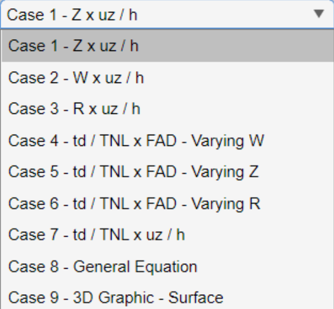

# DYNAblast Software Version 2.0

# Introduction

DYNAblast is a software developed in the MATLAB language and designed with the aim of analyzing composite laminated plate structures considering blast loading. Assuming this type of structure, its physical and geometric modifications and the characteristics of the explosive to be used, the engineer/researcher is able to design structures that can be resistence to collapses with the help of DYNAblast. Other applications can be highlighted, such as the corresponding of military research, aeronautics, marine, platforms and other examples which can be surprised by impact loads (shock waves). On this basis, DYNAblast was developed to facilitate the analysis of displacements, stresses and strain of any coordinates of the plate structure. In addition, parametric analyses are incorporated into the program, such as checking the maximum displacement curves according to changes in the characteristics of the explosive, Dynamic Amplification Factor curves and others.
DYNAblast 2.0 is a generalization and consideration of more types of structures compared to its predecessor [DYNAblast 1.1](https://github.com/AnaWaldila/dynablast1.1), its considerations were restricted to isotropic thin plates only. Version 2.0 therefore updates the plate analysis using 4 types of laminar plate theories, which can be orthotropic, and also applies other characteristic equations of the explosion curves.

## Methodology

The entire methodology used to build the software can be found in the Doctoral Thesis entitled ["Nonlinear dynamic analysis of composite laminated structures considering the explosion phenomenon"](https://www.bdtd.uerj.br:8443/handle/1/21714). In this thesis, it is possible to observe the definitions and formulations linked to explosive loading, as well as the plate theories used, methodologies and _**demonstration**_ of all the formulations used. This description is therefore restricted to the DYNAblast software version 2.0.

## Software

DYNAblast initializes with a window, as shown in Figure 1, displaying two _tabs_ for entering data. The first contains data on the physical-geometric characteristics of the structure. The second contains the characteristics of the type of analysis to be applied and the explosive loading data.

 <b>Figure 1:</b> DYNAblast 2.0 - Input Data

### Physical and Geometric Characteristics of the Structure;

Figure 1 shows the physical and geometric characteristics of the structure, such as:

* _Boundary Conditions_: Support (SS1, SS2 or CCCC). In this case, the boundary conditions are either simply supported (SS1 or SS2) or campled (CCCC). In the case of SS1, it corresponds to the characterization of _cross ply_ type plates. In the case of SS2, they are _angle ply_ plates;
* _Damping's Coefficient_: characterized by the structure's damping coefficient, if exists;
* _Length at x axis (m)_: length of the plate along the x axis;
* _Length at y axis (m)_: length of the plate along the y axis;
* _Shear Factor_: shear coefficient (or factor), which is applicable to the FSPT (First Shear Plate Theory) type theory;
* _Analysis point at x_: point whose x coordinate is to be analyzed;
* _Analysis point at y_: point whose y coordinate is to be analyzed;
* Table: In this case, the table is an easy and simplified way of entering the characteristics of each layer in the laminated plate. It is very important for the user to understand the order in which the rows are inserted corresponds to the order in which the laminates are inserted. In other words, the first line corresponds to the top layer, and then the last line, which corresponds to the last one. Therefore, the characteristics to be inserted are _height_, _mass density_ (density of each layer), _angle_ (angle of the fiber in each layer, in rad), _&nu;12_ e _&nu;12_ (Poisson's coefficients), _E1_ e _E2_ (Young's modulus) and _G12_, _G13_ and _G23_ (Shear's modulus).

Also in the Figure 1, in the second _tab_, you can see two separation _containers_: _Explosion Loading_ and _Analysis_. 
For _Explosion Loading_, the following user information is required:

### Explosion's Characteristics

* _Type of Equation_: Type of equation of the explosion curve. In this case, 6 possibilities are presented (see Figure 2):
  1. _Friedlander + Cubic Equation - Rigby Calibration_: The positive phase is characterized by the Friedlander equation and the negative phase is described according to the cubic polynomial. In this case, the input data is based on the value _scale distance Z (kg/m^1/3)_ and the total mass of explosive, _Total Mass (kg)_. The software determines all the characteristic values of the explosion (pmax, pmin, td, tm etc) based on the calibration realized by Rigby (2013);
  2. _Friedlander + Cubic Equation (calculating tm) - Rigby Calibration_: The same concepts are used as for the first option. However, for this case, the value of the negative phase's time is calculated according to the equilibrium equation determined by Granström (1956). The calibration carried out by Rigby (2013) is used to determine the other parameters;
  3. _Friedlander + Cubic Equation (calculating tm) - Reis Calibration_: The same concepts are used as for the first option. However, for this case, the value of the negative phase's time is calculated according to the equilibrium equation determined by Granström (1956). The calibration carried out by Reis (2019) is used to determine the other parameters;
  4. _Friedlander + Cubic Equation - Experimental Data_: The positive phase is characterized by the Friedlander equation and the negative phase is described according to the cubic polynomial. However, the input data is directly the characteristic parameters of the explosion, i.e, _Max Sobrepressure (Pa)_, _Max Underpressure (Pa)_, _Positive time (s)_, _Positive Impulse (Pa.s)_, _Negative Impulse (Pa.s)_ and _decay coefficient_.
  5. _Expanded Friedlander - Rigby Calibration_: The governing equation for the explosion is given by the Friedlander equation, even for the negative phase. In this case, the input data is the _scale distance Z (kg/m^1/3)_ and the _Total Mass (kg)_. The software determines all the characteristic values of the explosion (pmax, pmin, td, tm etc) based on the calibration realized by Rigby (2013);
  6. _Expanded Friedlander - Experimental Data_: The governing equation of the explosion is given by the Friedlander equation, even for the negative phase. In this case, the input data is considered to be directly the characteristic parameters of the explosion, i.e., _Max Sobrepressure (Pa)_, _Max Underpressure (Pa)_, _Positive time (s)_, _Positive Impulse (Pa.s)_ , _Negative Impulse (Pa.s)_ and _decay coefficient_.
 

 <b>Figure 2:</b> DYNAblast 2.0 - Type of Equation

In _Characteristics_, explosion parameters are made available for editing according to the user's choice in _Type of Equation_. Accordingly, parameters such as _scaled distance Z_ and _total mass_ are available for editing when options 1, 2, 3 or 5 in _Type of Equation_ are chosen. The experimental data _Max Overpressure (Pa)_, _Max Underpressure (Pa)_, _Positive time (s)_, _Positive Impulse (Pa.s)_, _Negative Impulse (Pa.s)_ and _decay coefficient_ are available when options 4 or 6 are chosen.

In _Type of Explosion_ there are two options: _spherical_ or _hemispherical_ explosions. This option becomes important when options 1, 2, 3 or 5 are chosen in _Type of Equation_, since it is directly related to the abacus to be chosen and, consequently, the calibrations performed, Reis (2019) or Rigby (2013).

### Dynamic Analysis

In the case of _Analysis_, it is possible to observe the type of analysis that the user wishes to attribute to the model and some other specification details are directly specified in this part. The first step corresponds to the type of theory to be considered into the structure, among 4 available, as shown in Figure 3: CLPT (_Classical Laminated Plate Theory_), FSPT (_First Shear Plate Theory_), HSPT (_High Shear Plate Theory_) and TvK (_von Karman Theory_).
Afterwards, the user must specify some other requirements, such as:
* _Type of Analysis_: Duration of dynamic loading. Of course, the explosive loading corresponds to the total duration of the positive and negative phases. However, the user can specify a longer or shorter time in comparison with the total time of the blast load;
* _Negative Phase_: Option of whether or not to consider the negative phase in the analysis. Independently of the option chosen in _Type of Equation_, if the user chooses not to have a negative phase, the program automatically performs the calculations only applying the Friedlander equation during the positive phase. For the remaining analysis time, free vibration is applied;
* _Dynamic Analysis_: The user can perform a dynamic or static analysis on the model;
* _Analysis of Stress and Strain_: This option is provided to the user so that, when performing a dynamic analysis, the software can calculate the dynamic stress and strain behavior of the coordinate chosen for analysis. However, this active option can cause a delay in the calculation and analysis process. Therefore, if the user only wants to evaluate the displacements at a given coordinate, simply leave this option disabled.

 <b>Figure 3:</b> DYNAblast 2.0 - Type of Analysis

### Parametric Analysis
The second part of _Analysis_ contains parametric analyses. In _Case of Analysis_ you can find 9 cases of parametric analysis, as shown in Figure 4:

* _Case 1 – Z x uz/h_: Analysis of the behavior of uz/h in comparison to the variation of Z, where the main step in Z;
* _Case 2 – W x uz/h_: Analysis of the behavior of uz/h in comparison to the variation of W, where the main step in W. In this case, the user needs to complete the “Final TNT’s mass (kg)” and the “Number of intervals”. Consequently, in this case, is looping and the TNT’s mass to start this is completed in “Total mass (kg)” (in characteristics, TNT);
* _Case 3 – R x uz/h_: Analysis of the behavior of uz/h in comparison to the variation of R, where the main step in R;
* _Case 4 – td/TL x FAD – Varying W_: A specific case to analyze the behavior of uz / h when DAF (Dynamic Amplification Factor) is varying. The main step is in W. In this case, the user needs to complete the “Final TNT’s mass (kg)” and the “Number of intervals”. Consequently, in this case, is looping and the TNT’s mass to start this is completed in “Total mass (kg)” (in characteristics, TNT);
* _Case 5 – td/TL x FAD – Varying Z_: A specific case to analyze the behavior of uz / h when DAF (Dynamic Amplification Factor) is variating. The main step is in Z.
* _Case 6 – td/TL x FAD – Varying R_: A specific case to analyze the behavior of uz / h when DAF (Dynamic Amplification Factor) is variating. The main step is in R.
* _Case 7 – td / TL x uz / h_: A specific case to analyze the behavior of uz / h when td / TL (rate between the time of duration of positive phase and the linear period of the structure) is varying. The main step is in Z;
* _Case 8 – General Equation_: A specific case to calculate the same graph of “Case 1”, but showing an equation that characterizes the structure, i.e., a relation of uz/h, Z, and W.
* _Case 9 - Surface W X R X uz/h_: A specific case to show a 3d graphic (surface) that characterizes the the maximum displacement of the plate (uz/h) when Z and W varying. In this case, the user needs to inform the "Final TNT's mass (kg)" and the "Number of intervals" between the initial and final mass (the initial mass is the input data into the label "Total Mass (kg)").

 <b>Figure 4:</b> DYNAblast 2.0 - Case of Analysis

Após a inserção de todas as informações descritas, o usuário pode escolher entre os botõpes _Dynamic Analysis_ ou _Advanced Analysis_, ou seja, o primeiro corresponde à análise dinâmica de determinação de deslocamento x tempo (tensões e deformações, caso seja desejo do usuário) e a segunda opção é referente à análise paramétrica. Na Figura 5 é apresentado _layout_ da janela de resultados, considerando uma análise dinâmica simples. Já nas Figuras 6 à 9 encontram-se os resultados referêntes à análise paramétrica, considerando Caso 1 ao Caso 4, respectivamente.

 <b>Figure 5:</b> DYNAblast 2.0 - Dynamic Analysis

 <b>Figure 6:</b> DYNAblast 2.0 - Parametric Analysis, Case 1

 <b>Figure 7:</b> DYNAblast 2.0 - Parametric Analysis, Case 2

 <b>Figure 8:</b> DYNAblast 2.0 - Parametric Analysis, Case 3

 <b>Figure 9:</b> DYNAblast 2.0 - Parametric Analysis, Case 4

 <b>Figure 9:</b> DYNAblast 2.0 - Parametric Analysis, Case 5

 <b>Figure 9:</b> DYNAblast 2.0 - Parametric Analysis, Case 6

 <b>Figure 9:</b> DYNAblast 2.0 - Parametric Analysis, Case 7

 <b>Figure 9:</b> DYNAblast 2.0 - Parametric Analysis, Case 8

 <b>Figure 9:</b> DYNAblast 2.0 - Parametric Analysis, Case 9

### About

This software was developed by Dr. Ana W.Q.R. Reis and supervised by professor Dr. Rodrigo B. Burgos, at Rio de Janeiro State University, as show in Figure 10.

 <b>Figure 10:</b> DYNAblast 2.0 - About the Software

## References
REIS, Ana Waldila de Queiroz Ramiro. [Nonlinear dynamic analysis of composite laminated structures considering the explosion phenomenon](https://www.bdtd.uerj.br:8443/handle/1/21714). 2023. 275 f. Doctorate Thesis (Portuguese) - Faculty of Engineering, State University of Rio de Janeiro, Rio de Janeiro, 2023.

Reis, A.W.Q.R., Oliveira, M.F.F, Burgos, R.B. [DYNAblast - A software to obtain the behavior of plates subjected to blast loads](https://www.softxjournal.com/article/S2352-7110(22)00151-0/fulltext). SoftwareX, 2022.

Reis, A.W.Q.R. [Dynablast Version 1.0](https://github.com/AnaWaldila/dynablast). Github, 2022.

## General Information and Contact

Rio de Janeiro State University

Faculty of Engineering

Developer: Dr. Ana Waldila de Queiroz Ramiro Reis

Professor: Dr. Rodrigo Bird Burgos

Contact: anawaldila@hotmail.com
